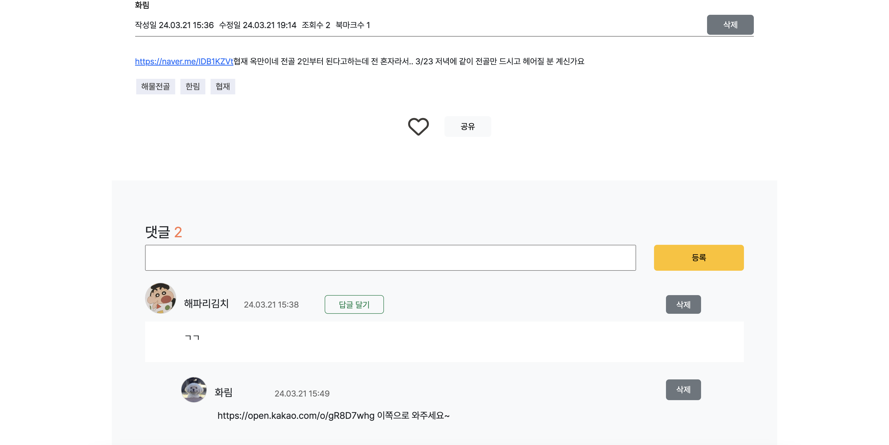

# 제주도랑(Jeju-dorang) 


<p>제주도랑은 사용자들이 편리하게 소통할 수 있는 커뮤니티를 제공합니다. 커뮤니티는 '모임'과 '잡담' 두 개의 게시판으로 구성되는데, '모임' 게시판은 사용자들이 각자의 여행에 함께할 동행 파트너를 구하는, 제주도랑의 주 기능을 제공하는 공간입니다. 혼자 간 여행에서 2인 식사부터 가능한 식당에 결국 가지 못했을 때 우울했던, 관광 체험 상품을 혼자 신청하기는 머쓱했던 경험으로 편하고 자유롭게 동행을 구하는 공간이 있으면 좋겠다고 생각되어 구현하게 된 게시판입니다. 이 게시판에서는 여행 전체를 함께 할 동행을 찾거나, 특정 액티비티를 함께 즐길 동행을 구하거나, 식사를 함께 할 동행을 찾는 등 기간이나 활동에 구애받지 않고 다양한 동행 파트너를 구할 수 있습니다. 글 작성 형식에 제한을 두지 않아 사용자들이 자유롭게 동행을 구할 수 있도록 했습니다. 여행 합류를 원하는 사용자는 해당 게시글에 댓글을 작성하고, 게시글 작성자는 발생한 새 댓글 알림을 통해 이를 확인하고 카카오톡 오픈 채팅 링크 같은 연락 수단을 대댓글로 작성하는 것 같은 방법으로 합류가 이루어지게 됩니다. 댓글 작성자에게도 똑같이 새 대댓글 알림을 발생시켜 원활한 확인을 가능하게 했습니다. 게시글 작성자는 원하는 동행을 모두 구했을 경우 게시글의 모집중 버튼을 모집완료 버튼으로 변경해 상태를 표시할 수 있습니다.</p>

<p>잡담 게시판은 사용자들이 자유롭게 이야기를 나누고, 제주도 여행에 대한 정보를 공유하는 공간입니다. 다녀온 관광지, 식당에 대한 후기나 현재 날씨 혹은 여행 계획에 대한 조언 요청 같은 여행에 대한 정보를 활발하게 나눌 수 있는 게시판을 생각하고 구현하게 되었습니다.</p>

<p>부가적으로, 제주도랑은 제주도 공공데이터를 활용하여 제주도 여행지들을 소개합니다. 여행 계획을 세울 때나 여행 중 방문할 관광지나 식당을 찾을 때 효율적이고 편리하게 사용할 수 있는 여행지 데이터베이스가 있으면 좋겠다는 요지에서 만들게 된 기능입니다. 주 기능인 동행 파트너를 구하는 게시판과 여행지 정보를 모아볼 수 있는 게시판이 함께 있으면 긍정적인 시너지 효과를 낼 수 있을 것이라고 생각했습니다. 여행할 때 주로 찾게 되는 쇼핑, 관광, 식당 카테고리로 구분하여 여행지 목록을 정렬해 사용자에게 보여주도록 구현했습니다. 여행 계획에 도움이 되도록 여행지의 위치, 간단한 설명, 관련 태그를 표시했습니다. 또한 사용자는 북마크 기능을 활용하여 가고자 하는 여행지를 저장해두고 마이페이지에서 한 눈에 확인할 수 있습니다.</p>

<br>

### 🗓️ 개발 기간
2023.12.28 ~ 2024.03

<a href="https://cute-skipjack-fb9.notion.site/Spring-SpringBoot-Migration-a303908d6b6349e38938166b269c20d8?pvs=4"></a>

  
<br>

### 🛠 사용 기술
- IDE

    
    
- Frontend
  
    
    
    
    
    
- Backend

    
    
    

  - DataBase

    
    
    
    

  - Security / Authentication & Authorization

    
    
    
  
<br>

### 🌐 2024.03.05 배포


http://43.201.67.46:8080/

GitHub Actions를 사용하여 CI/CD 파이프라인을 구축하고, EC2 인스턴스 내에서 MariaDB, Redis, 스프링부트 프로젝트 Docker Container를 실행하는 방식으로 배포했습니다.

<br>

### ERD


<br>

### System Architecture


<br>

### Swagger: API 명세서
http://43.201.67.46:8080/api-docs 에서 /api-docs/json 검색
- json 문서로 열람: http://43.201.67.46:8080/api-docs/json

<br>

## 화면 구성
#### 메인 페이지

|  | 로그인하지 않았을 경우                                              | 로그인한 경우                                                   | 
|--|-----------------------------------------------------------|-----------------------------------------------------------|
|  |  |  |

메인 페이지 배경 사진: https://unsplash.com/ko

모든 알림 모달: SweetAlert2 https://sweetalert2.github.io/


- 헤더 알림

  |   | 알림 없을 경우                                                                                 | 알림 발생                                                                        |
  |---|------------------------------------------------------------------------------------------|------------------------------------------------------------------------------|
  |   |                   |       |
  |   | 알림 모달                                                                                    | 알림 모달                                                                        |
  |   |  |  |

  - 새 알림이 발생할 경우 헤더의 알림 메뉴 색상 변경
  - 알림 모달의 읽은 알림과 읽지 않은 알림을 카드 배경색으로 구분
  - 알림 카드를 클릭할 경우 해당 게시글로 이동
  - 알림은 댓글과 대댓글로 구분
  - 카드 우측 상단 X 아이콘을 클릭해 알림 삭제
  
  <br>

  - 게시글/댓글 작성자가 로그인하고 있는 상황에서 새로운 알림이 발생할 경우 실시간 알림 모달 발생
  
    

  <br>

#### 여행 페이지

|   | 여행 메인 페이지                                               | 여행 상세 페이지                                                   |
|---|---------------------------------------------------------|-------------------------------------------------------------|
|   |  |  |

- 여행 데이터는 카테고리별로 정렬하거나 태그로 검색 가능
  
  - 카테고리 정렬과 태그 검색 동시에 적용 가능
  - 태그 복수 검색은 ','으로 구분해 검색
  - 검색 결과가 없을 경우 결과 없음 표시

| 북마크 | 로그인하지 않은 경우                                                                 | 로그인한 경우                                                                   |
|-----|-----------------------------------------------------------------------------|---------------------------------------------------------------------------|
|     |  |  |

- 로그인하지 않은 상태에서 북마크 버튼을 클릭할 경우 로그인 필요 모달 표시
- 로그인한 경우 북마크 설정 (채워진 하트로 표시): 채워진 하트를 클릭할 경우 북마크 삭제
- 북마크 목록은 마이페이지에서도 열람/삭제 가능

  <br>

#### 커뮤니티 페이지
| 메인 | 모임                                                                           | 잡담                                                                         | 
|----|---------------------------------------------------------------------------------|----------------------------------------------------------------------------|
|    |      |   |
|    | 글 검색/정렬                                                                         | 글 검색/정렬                                                                    |
|    |  |  |

인프런 스터디 페이지 레이아웃/디자인 참고: https://www.inflearn.com/community/studies

태그 작성: Tagify https://github.com/yairEO/tagify

- 글제목 검색 & 태그 검색 & 기준별 정렬 
- 모집 게시판의 경우 모집상태(전체/모집중/모집완료)까지 적용한 검색/정렬 가능
- 검색 결과가 없을 경우 결과 없음 표시


- 글작성 페이지

  
  
  인프런 스터디 글쓰기 페이지 레이아웃/디자인 참고: https://www.inflearn.com/community/studies

  태그 작성: Tagify https://github.com/yairEO/tagify

  글 작성: TOAST UI Editor https://github.com/nhn/tui.editor

  - 로그인하지 않은 경우 로그인 폼으로 리다이렉트
  

- 커뮤니티 상세글(모임)

  

- 모임 게시글 작성자는 모집상태 버튼 클릭을 통해 모집중/모집완료 상태 변경 가능
- 게시글 작성자: 게시글 수정/삭제 가능
- 로그인한 회원은 댓글/대댓글 작성 가능, 댓글 작성자 본인은 댓글 수정/삭제 가능
- 삭제된 댓글은 '삭제된 댓글입니다'로 표시
- 삭제된 댓글을 뺀 댓글 합으로 총 댓글 개수 표시: 댓글순 정렬할 때 삭제되지 않은 댓글 수로 정렬
- 게시글 SNS 공유 가능
- 로그인한 회원은 게시글 북마크 가능 (여행 북마크와 동일)

<br>

#### 회원가입/로그인
 

|  | 아이디 찾기                                              | 비밀번호 찾기                                               | 
|--|-----------------------------------------------------|-------------------------------------------------------|
|  |  |  |
| | 가입된 이메일을 입력할 경우 입력한 이메일로 아이디 전송 | 가입된 회원정보와 일치하는 이메일과 아이디를 입력할 경우 입력한 이메일로 임시 비밀번호 전송 |

<br>

#### 마이페이지


- 소셜로그인 회원의 경우 이메일, 비밀번호 변경이 불가능

  

  

<br>

#### 관리자
| | 관리자 회원가입                                                      | 관리자 페이지                                                   | 커뮤니티 상세글                                                     | 
|-|---------------------------------------------------------------|-----------------------------------------------------------|--------------------------------------------------------------|
| |  |  |  |
| | 관리자 회원가입 페이지                                        | 관리자 마이페이지: S3 버킷에 저장된 주인없는 이미지 일괄 삭제 가능                   | 회원들이 작성한 게시글/댓글 삭제 가능                                        |

<br>

## 설치
### Project Clone
```bash
~$ git clone https://github.com/dongur2/jeju-dorang-springboot.git
```
- `application.yml` 파일 생성 후 변수 설정

<br>

### MariaDB 11.2.2
#### Window

MariaDB 설치

https://mariadb.org/download/?t=mariadb&p=mariadb&r=10.11.7&os=windows&cpu=x86_64&pkg=zip&m=blendbyte

데이터베이스 생성
```bash
~$ create database jeju_dorang;
```
  
#### Mac
  
Homebrew 업데이트
```bash
~$ brew update
```

MariaDB 설치
```bash
~$ brew install mariadb
```

Homebrew로 MariaDB 실행
```bash
~$ brew services start mariadb
```

MariaDB 접속
```bash
mariadb
```

데이터베이스 생성
```bash
create database jeju_dorang;
```

<br>

### Redis 7.2.4
#### Window
Redis 설치

https://github.com/microsoftarchive/redis/releases

redis-cli.exe로 Redis 실행

Redis 비밀번호 설정
```bash
vi /etc/redis/redis.conf
```

- `requirepass {비밀번호}`


#### Mac

Redis 설치
```bash
~$ brew install redis
```

Redis를 background로 실행
```bash
~$ brew services start redis
```

Redis 비밀번호 설정
```bash
vi /etc/redis/redis.conf
```

- `requirepass {비밀번호}`

<br>

### 프로젝트 실행 후 권한 데이터 생성
```bash
insert into role(name) values('ADMIN');
insert into role(name) values('USER');
```

### 관리자 생성
`http://43.201.67.46:8080/admin`

### 여행 API 데이터 다운로드 (관리자 권한 필요)
`http://43.201.67.46:8080/trip/api/data`

<br>

## 변경 로그
